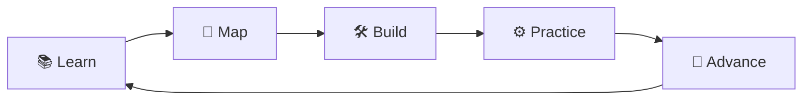
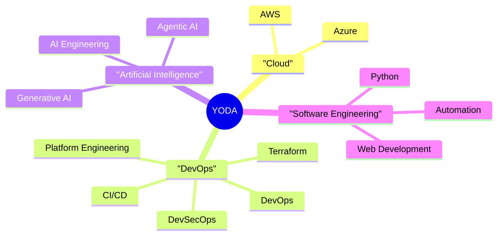
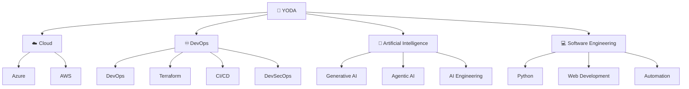
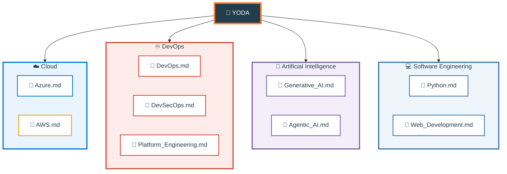
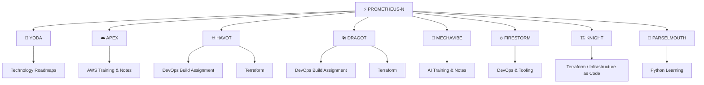
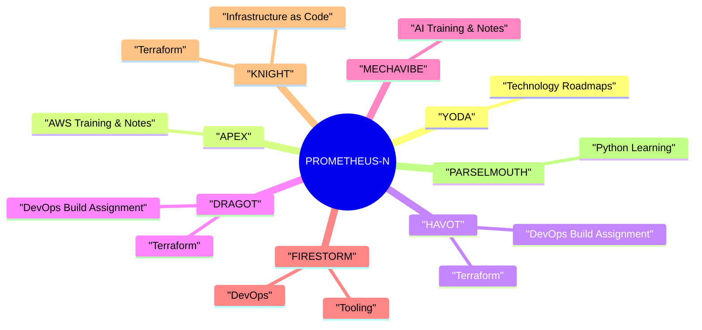
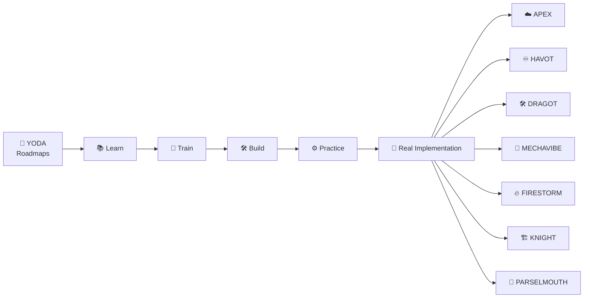
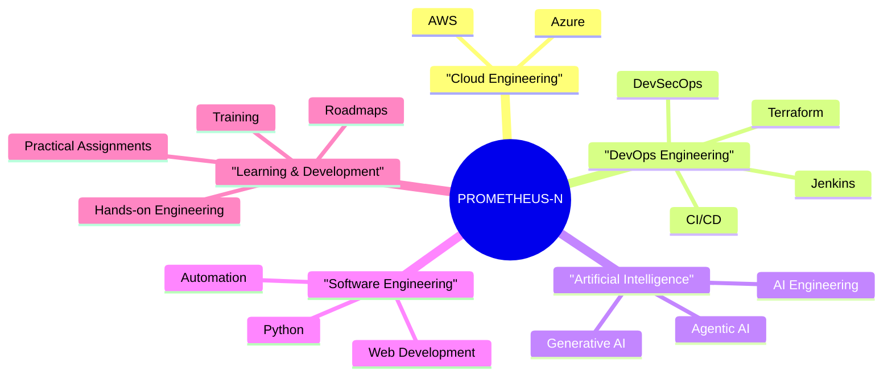
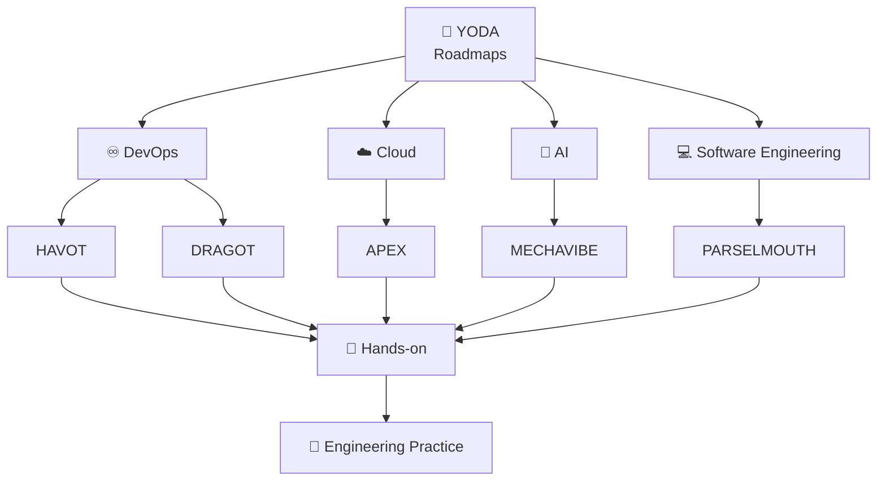

# 🧭 YODA

> **Your Organized Development & Advancement**


---

## 🧭 About YODA

**YODA** is the public roadmap hub of the **PROMETHEUS-N** engineering ecosystem.

It provides a visual representation of technology learning paths through:

- 🗺️ Technology roadmaps
- 🧠 Mermaid mind maps
- 🌐 Learning-path overviews
- 📈 Technology progression maps

YODA is intentionally kept lightweight.

The detailed training, implementation, notes, experiments, and hands-on work are maintained in their respective repositories across the **PROMETHEUS-N** organization.

---

# 🎯 Purpose



**YODA maps the learning journey.  
The individual repositories contain the actual work.**

---

# 🧠 YODA Ecosystem



---

# 🗺️ Roadmap Categories



---

# 📂 Repository Structure

Each roadmap is maintained as a **single Markdown file**.



Each roadmap file can contain:

```mermaid
mindmap
      🖼️ Visual Roadmap
      🧠 Mermaid Mind Map
```

---

# ⚡ PROMETHEUS-N

YODA is one part of the wider **PROMETHEUS-N** engineering ecosystem.



---

# 🧩 Repository Ecosystem



---

# 🔄 Learning-to-Implementation Flow



---

# 🧠 Technology Landscape



---

# 📌 Repository Roles

| Repository | Focus |
|---|---|
| **YODA** | 🧭 Public technology roadmaps |
| **APEX** | ☁️ AWS training & notes |
| **HAVOT** | ♾️ DevOps build assignment using Terraform |
| **DRAGOT** | 🛠️ DevOps build assignment using Terraform |
| **MECHAVIBE** | 🤖 AI training & notes |
| **FIRESTORM** | 🔥 DevOps and tooling ecosystem |
| **KNIGHT** | 🏗️ Terraform & Infrastructure as Code |
| **PARSELMOUTH** | 🐍 Python learning |

---

# 🌐 Public Learning Model



---

# 🗂️ What YODA Contains

### ✅ Included

- 🗺️ Technology roadmaps
- 🧠 Mermaid mind maps
- 📊 Visual learning paths
- 🌐 Public technology progression maps

### ❌ Not Included

- ❌ Personal certification records
- ❌ Resume information
- ❌ Company training certificates
- ❌ Detailed technical notes
- ❌ Project implementation documentation
- ❌ General resource collections

Those areas belong in their appropriate repositories within the **PROMETHEUS-N** ecosystem.

---

# 🧭 Roadmap Philosophy

```text
                    ┌─────────────────┐
                    │      YODA       │
                    │  MAP THE PATH   │
                    └────────┬────────┘
                             │
             ┌───────────────┼───────────────┐
             │               │               │
          CLOUD           DEVOPS             AI
             │               │               │
             └───────────────┼───────────────┘
                             │
                    ┌────────▼────────┐
                    │     BUILD       │
                    └────────┬────────┘
                             │
                    ┌────────▼────────┐
                    │    PRACTICE     │
                    └────────┬────────┘
                             │
                    ┌────────▼────────┐
                    │    ADVANCE      │
                    └─────────────────┘
```

---

## ⚡ YODA

> **Map the path. Learn the technology. Build the capability.**

---

### PROMETHEUS-N

**Learn → Map → Train → Build → Practice → Advance**

