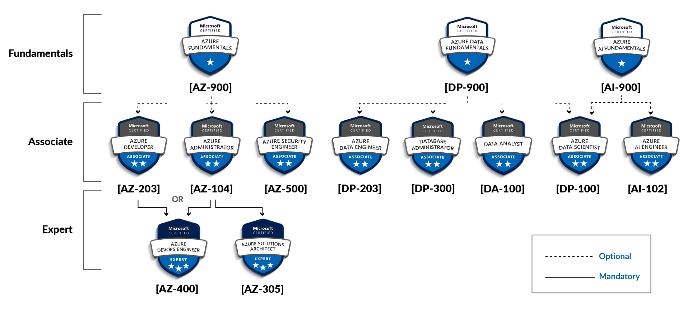

# Learning_Career Repository
This Repository is created for Tracking the Learnings and Certifications That have and need to be taken for the IT Career

# Azure Certification RoadMap 
  - The Below Image shows the Road Map for Microsoft Azure Certified Certifications

# Completed Certifications
  - The Below Subheadings show the Certifications Taken and Completed
## Microsoft Certified

### AZ-104
  - Azure Administrator Associate

### AZ-400
  - Designing and Implementing Microsoft DevOps Solutions

## Hashi Corp
  - Terraform Associate-004 
