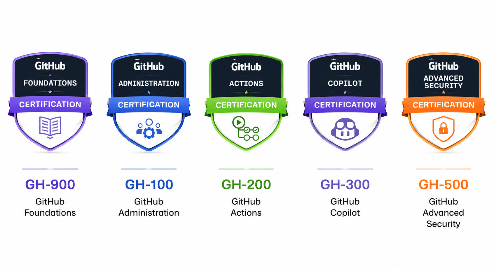
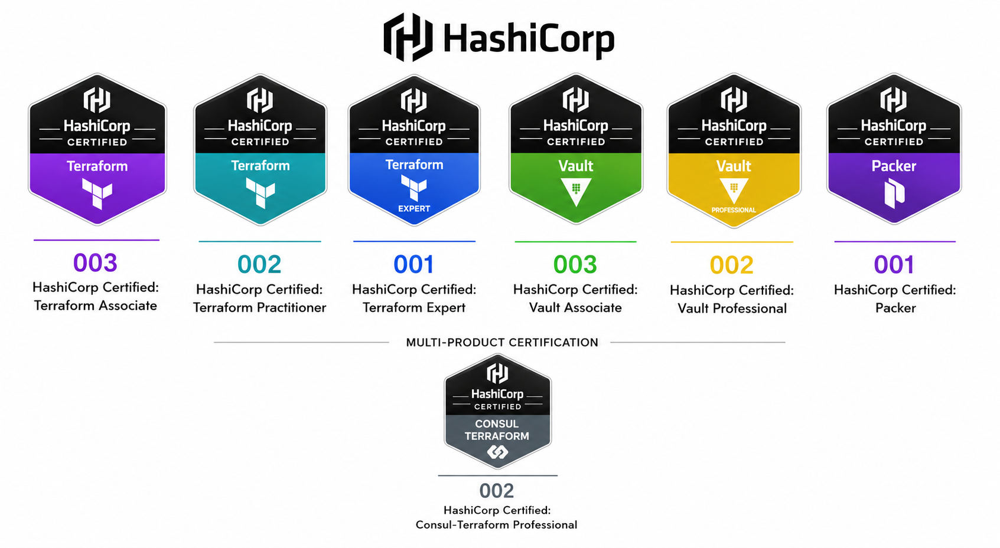
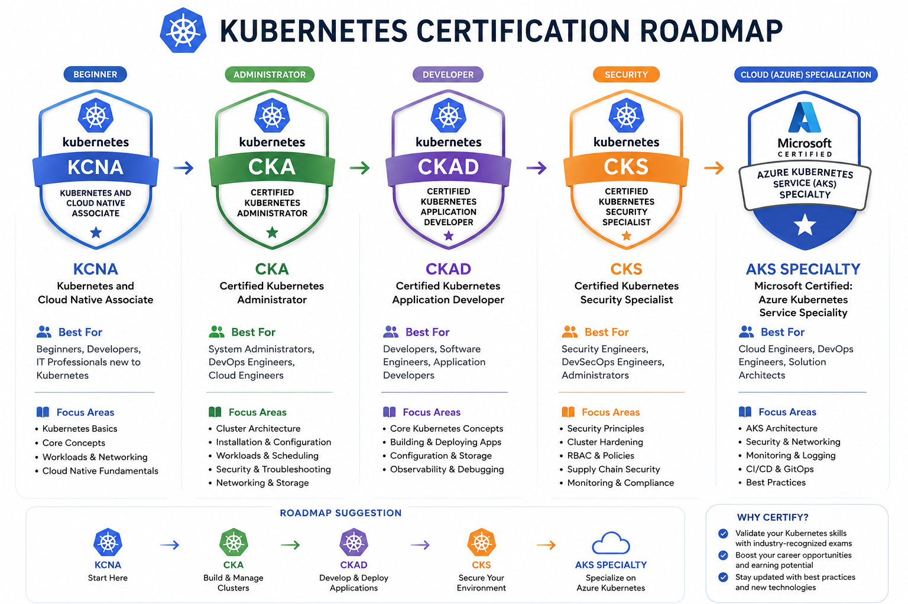

# 🚀 Learning_Career Repository

## 📚 Learning • 🏅 Certifications • 🚀 Career Growth

---

# 📖 About This Repository

This repository is created for tracking:

- 📚 Technical Learnings
- 🏅 Certifications Completed
- 🎯 Future Certification Goals
- ☁️ Cloud & DevOps Career Progress

---

# 🏆 Completed Certifications

The below sections show the certifications completed successfully ✅

---

## ☁️ Microsoft Certified

### ✅ AZ-104 — Azure Administrator Associate
🏅 Certification:  
[Azure Administrator Associate](https://learn.microsoft.com/en-us/credentials/certifications/azure-administrator/)

---

### ✅ AZ-400 — Designing and Implementing Microsoft DevOps Solutions
🏅 Certification:  
[Microsoft DevOps Engineer Expert](https://learn.microsoft.com/en-us/credentials/certifications/devops-engineer/)

---

### ✅ GH-200 — GitHub Actions
🏅 Certification:  
[GitHub Actions Certification](https://learn.microsoft.com/en-us/credentials/certifications/github-actions/)

---

## 🏗️ HashiCorp Certified

### ✅ Terraform Associate-004
🏅 Certification:  
[HashiCorp Certified: Terraform Associate-004](https://www.hashicorp.com/certification/terraform-associate)

---

# 📌 Certification Progress Checklist

## ☁️ Microsoft Azure Certifications
- [x] <strong> AZ-104 — Azure Administrator Associate</strong>
- [x] <strong> AZ-400 — Designing and Implementing Microsoft DevOps Solutions</strong>
- [ ] AZ-305 — Azure Solutions Architect Expert
- [ ] AZ-500 — Azure Security Engineer Associate

---

## 🐙 GitHub Certifications
- [x] <strong> GH-200 — GitHub Actions</strong>
- [ ] GH-900 — GitHub Foundations
- [ ] GH-100 — GitHub Administration
- [ ] GH-300 — GitHub Copilot
- [ ] GH-500 — GitHub Advanced Security

---

## 🏗️ HashiCorp Certifications
- [x] <strong> Terraform Associate-004</strong>
- [ ] Vault Associate
- [ ] Consul Associate
- [ ] Terraform Professional

---

## ☸️ Kubernetes / AKS Certifications
- [ ] KCNA — Kubernetes and Cloud Native Associate
- [ ] CKA — Certified Kubernetes Administrator
- [ ] CKAD — Certified Kubernetes Application Developer
- [ ] CKS — Certified Kubernetes Security Specialist
- [ ] Microsoft AKS Specialization

---

# 🎯 Career Goal

To become a highly skilled:

- ☁️ Cloud Engineer
- 🚀 DevOps Engineer
- ☸️ Kubernetes Administrator
- 🏗️ Infrastructure Automation Engineer

by continuously learning and achieving industry-recognized certifications.

---

# 🛠️ Technologies Covered

| Technology | Area |
|---|---|
| ☁️ Microsoft Azure | Cloud Computing |
| 🐙 GitHub | Source Control & CI/CD |
| 🏗️ Terraform | Infrastructure as Code |
| ☸️ Kubernetes / AKS | Container Orchestration |
| 🔄 Azure DevOps | CI/CD Pipelines |
| 🐳 Docker | Containerization |
| 🖥️ Linux | System Administration |
| 📜 IaC | Automation |

---

# ☁️ Azure Certification RoadMap

---

# 🐙 GitHub Certification RoadMap

---

# 🏗️ HashiCorp Certification RoadMap

---

# ☸️ Kubernetes / AKS Certification RoadMap

---

## ⭐ Keep Learning | Keep Building | Keep Growing ⭐

